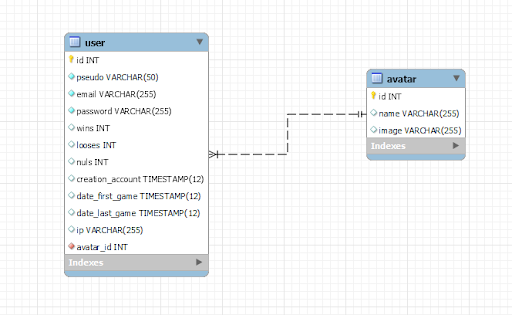
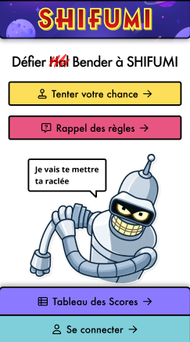
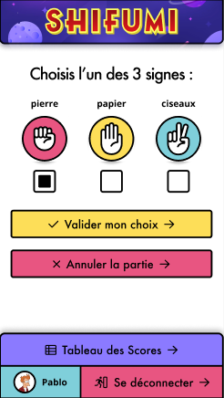

# __Shifumi__

Ce projet est un projet d'école consistant à créer un jeu de shifumi avec une certaine logique.

## Groupe sur le projet
----------------------------

- Grégoire GAUTIER : https://github.com/gregoiregautier
- Nicolas GUILLEMIN : https://github.com/Nicox44
- Emilien CUNY : https://github.com/ArToXxFR

## Langages utilisés ? 
----------------------------

  - PHP
  - HTML 
  - CSS
  - JavaScript
  - SQL
  
  Modèle physique de données : 

  

## Le contenu
----------------------------

L'utilisateur peut créer un compte qui sera stocké en base de donnée.

Une fois le compte créé, le joueur peut se connecter. Il aura donc accès aux règles, au tableau des scores et pourra jouer au shifumi.

Le joueur choisit entre pierre, papier ou ciseaux et valide son choix. Une fois le choix validé, 
l'utilisateur pourra savoir si oui ou non il a gagné contre notre algorithme.

## Aperçu
----------------------------

## Responsive ?
----------------------------

Oui ! Le projet est totalement responsive.

## Installation du projet
----------------------------

### Prérequis

 - Apache
 - MySQL / MariaDB
 - PHP

Pour installer la base de donnée, il faudra d'abord créer une base de donnée.
Dans cette base de donnée on va pouvoir importer le fichier shifumi.sql.

Une fois la base de donnée installée, on va pouvoir créer un fichier .env qui va contenir le nom d'hôte, le nom de la base de donnée, le nom d'utilisateur ainsi que le mot de passe.

Suivre le format du .env.sample et complétons avec nos informations.

Il ne vous reste plus qu'à nous connecter depuis le navigateur et le tour est joué !

